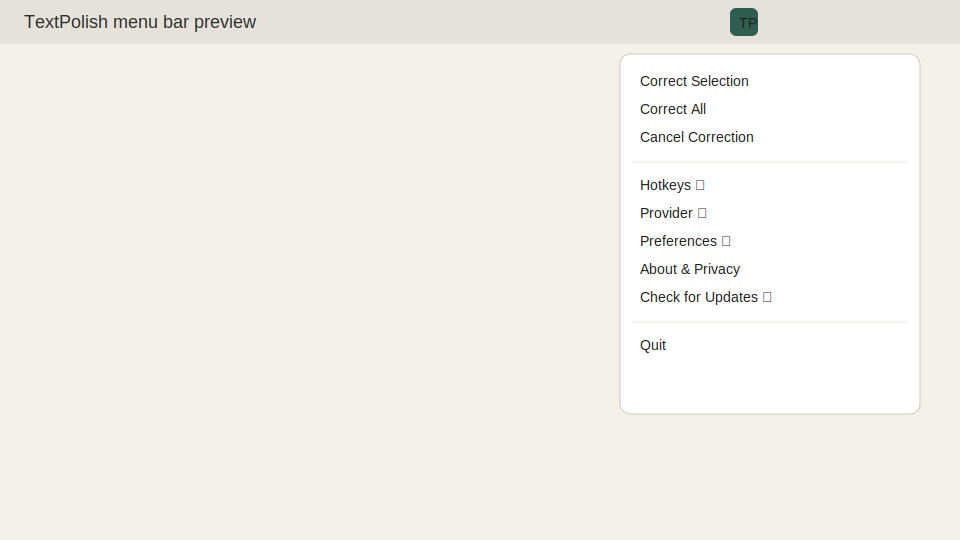

# TextPolish

Small, fast menu bar app for macOS that fixes grammar and typos in any app (Discord, etc). It keeps your formatting and tone and restores your clipboard.

## Download

Latest release:
https://github.com/kxxil01/TextPolish/releases

Choose:
- TextPolish.app.zip for drag and drop install (move to /Applications)
- TextPolish.pkg for a guided installer

## Quick Start

1. Install TextPolish.app to /Applications and open it.
2. Grant Accessibility permission: System Settings -> Privacy & Security -> Accessibility -> TextPolish.
3. Set your API key from the menu: Backend -> Set Gemini API Key... (or OpenRouter).
4. Use the shortcuts below.

## Shortcuts

- Correct Selection: Ctrl+Option+Command+G
- Correct All: Ctrl+Option+Command+Shift+G (presses Command+A first)

## How it works

- Copies your selected text or current input.
- Sends that text to the chosen backend for correction.
- Pastes the corrected text back.
- Restores your clipboard.

## Menu

- Correct Selection / Correct All
- Cancel Correction
- Backend: Gemini or OpenRouter, set keys and models
- Hotkeys: change or reset
- Check for Updates
- Advanced: Start at Login, Fallback to OpenRouter on Gemini errors, Open Accessibility Settings, Open Settings File
- About and Privacy

## Updates

Updates are delivered through GitHub Releases. The app checks automatically about every 6 hours and you can run Check for Updates from the menu.
The menu also shows update status and the last check time.

## Advanced settings (optional)

Settings live in `~/Library/Application Support/TextPolish/settings.json` (open from the menu).

Per-app timing profiles (bundle id or app name keys):

```json
{
  "timingProfiles": {
    "Discord": {
      "copyTimeoutMilliseconds": 1200,
      "pasteSettleDelayMilliseconds": 40
    }
  }
}
```

Gemini fallback to OpenRouter on temporary errors (requires an OpenRouter key):

```json
{
  "fallbackToOpenRouterOnGeminiError": true
}
```

## Privacy

- Sends only the text you selected or the current input.
- No analytics or telemetry.
- API keys are stored in macOS Keychain.
- Your clipboard is restored after each correction.

## Troubleshooting

- No menu bar icon: open the app from /Applications and keep it running.
- Hotkeys do not work: grant Accessibility permission and focus the input field.
- Start at Login does not enable: install or move the app to /Applications first.
- Gemini says "model not found": use Backend -> Detect Gemini Model.
- Quota errors: switch backend or update your key.
- Check for Updates is disabled: this build does not have update info.

## Screenshot



## Build from source

Developer notes live in docs/development.md.

## Credits

Creator: Kurniadi Ilham (github.com/kxxil01)
