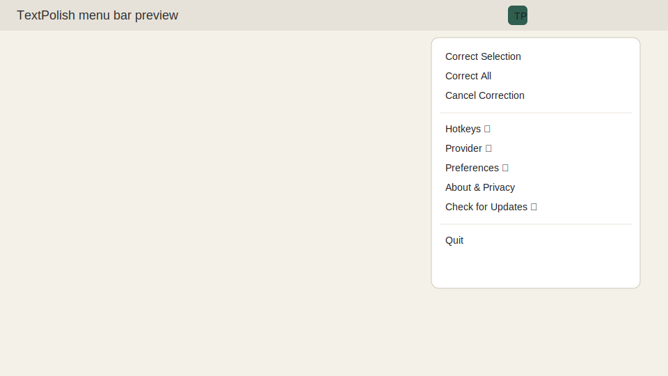

# TextPolish

TextPolish is a macOS menu bar app that improves writing in any app using global hotkeys.

It currently supports two workflows:
- Grammar correction (copy -> correct -> paste -> restore clipboard)
- Tone analysis (copy -> analyze -> show result window -> restore clipboard)



[](https://github.com/kxxil01/TextPolish/actions/workflows/ci.yml)
[](https://github.com/kxxil01/TextPolish/actions/workflows/release.yml)

## Current State (March 2026)

- Platforms: macOS 13+
- Providers: Gemini, OpenRouter, OpenAI, Anthropic
- Tone analysis: production path enabled
- Fallback mode: enabled by one setting, provider-paired fallback
  - Gemini <-> OpenRouter
  - OpenAI <-> Anthropic
- Test suite: 208 tests passing

## Features

- Global hotkeys that work across apps
- Clipboard-safe operations (snapshot + guaranteed restore)
- Minimal-edit correction policy (preserve voice and formatting)
- Protected token handling for code blocks, inline code, URLs, and mention-like tokens
- Retry logic and timeout bounds for provider requests
- Provider diagnostics and health status in the menu
- Daily usage counters (correction + tone analysis) with a combined status-bar badge
- Sparkle auto-update support in release builds

## Default Hotkeys

- Correct Selection: `Ctrl+Option+Command+G` (`⌃⌥⌘G`)
- Correct All: `Ctrl+Option+Command+Shift+G` (`⌃⌥⌘⇧G`)
- Analyze Tone: `Ctrl+Option+Command+T` (`⌃⌥⌘T`)

Hotkeys are configurable from the menu and settings window.

## Supported Providers

- Gemini
  - Default model: `gemini-2.5-flash`
  - Default base URL: `https://generativelanguage.googleapis.com`
- OpenRouter
  - Default model: `google/gemma-3n-e4b-it:free`
  - Default base URL: `https://openrouter.ai/api/v1`
- OpenAI
  - Default model: `gpt-5-nano`
  - Default base URL: `https://api.openai.com/v1`
- Anthropic
  - Default model: `claude-haiku-4-5`
  - Default base URL: `https://api.anthropic.com`

## Setup

1. Install and open TextPolish.
2. Grant Accessibility permission:
   - System Settings -> Privacy & Security -> Accessibility -> enable TextPolish
3. Configure at least one provider API key from the menu or settings window.

Provider key commands are available for all 4 providers in the menu.

## How It Works

### Grammar correction

1. Capture target app context
2. Snapshot clipboard
3. Send Command+C (or Command+A then Command+C for "Correct All")
4. Wait for copied text
5. Send to active provider
6. Paste corrected text
7. Restore original clipboard

### Tone analysis

1. Capture target app context
2. Snapshot clipboard
3. Send Command+C
4. Wait for copied text
5. Send to active provider
6. Show tone result panel near cursor
7. Restore original clipboard

## Reliability and Safety

- Deadlines are enforced across the whole operation to prevent runaway latency.
- Post-paste timeout is treated as successful completion when paste already happened.
- Escape key handling is maintained across repeated tone-result window open/close cycles.
- Hotkey capture monitors are cleaned up to avoid event monitor leaks.
- Endpoint path normalization handles custom base URLs (including proxy/gateway path prefixes).

## Diagnostics

From the menu, Diagnostics provides:
- Last operation snapshot (provider, model, latency, retries, fallbacks)
- Provider health state
- Active provider checks

Model and API checks include provider-specific request validation.

## Settings Storage

Settings file:
- `~/Library/Application Support/TextPolish/settings.json`

API key resolution order:
1. Keychain (primary service uses app bundle identifier, fallback default service)
2. Settings file value
3. Environment variable

Environment variables:
- Gemini: `GEMINI_API_KEY` or `GOOGLE_API_KEY`
- OpenRouter: `OPENROUTER_API_KEY`
- OpenAI: `OPENAI_API_KEY`
- Anthropic: `ANTHROPIC_API_KEY`

## Build and Run

Build app bundle:

```bash
./scripts/build_app.sh
open ./build/TextPolish.app
```

SwiftPM development:

```bash
swift build
swift run TextPolish
```

Release binary build:

```bash
swift build -c release
```

Run tests:

```bash
swift test
```

Build installer package:

```bash
./scripts/build_pkg.sh
open ./build/TextPolish.pkg
```

## Repository Map

Primary source files are in `src/`.

Key files:
- `src/AppDelegate.swift` - menu bar app lifecycle, menus, diagnostics, updates
- `src/CorrectionController.swift` - correction orchestration
- `src/ToneAnalysisController.swift` - tone orchestration
- `src/Settings.swift` - persisted configuration and defaults
- `src/ModelDetector.swift` - provider model detection logic
- `src/APIEndpointPaths.swift` - normalized endpoint path composition

Tests:
- `Tests/GrammarCorrectionTests/`

## Troubleshooting

- Hotkeys not firing:
  - Re-check Accessibility permission
  - Check for hotkey conflicts in other apps
- Model/API failures:
  - Verify provider key
  - Verify provider model and base URL
  - Run Diagnostics from the menu
- Start at Login issue:
  - Install app in `/Applications`

## Website and Docs

- Website: [textpolish.pages.dev](https://textpolish.pages.dev)
- Development guide: [docs/development.md](docs/development.md)
- Contributing: [CONTRIBUTING.md](CONTRIBUTING.md)

## License

MIT - see [LICENSE](LICENSE)
